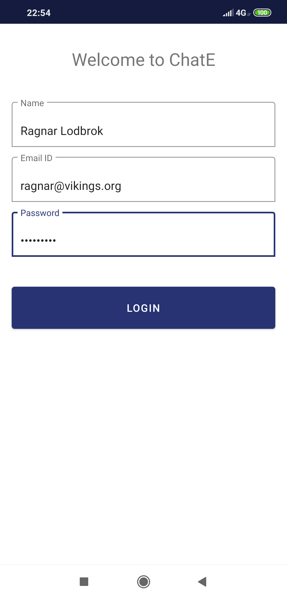
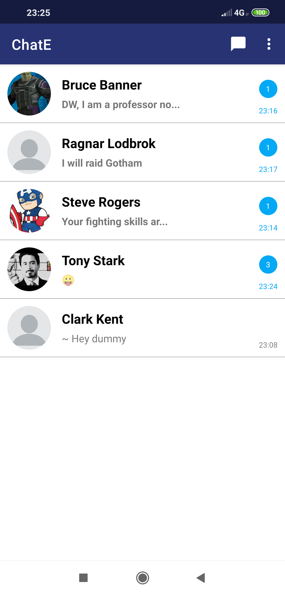
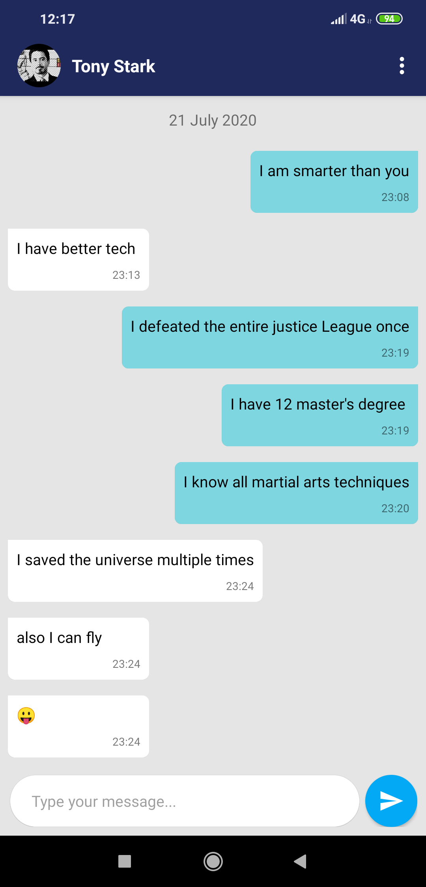
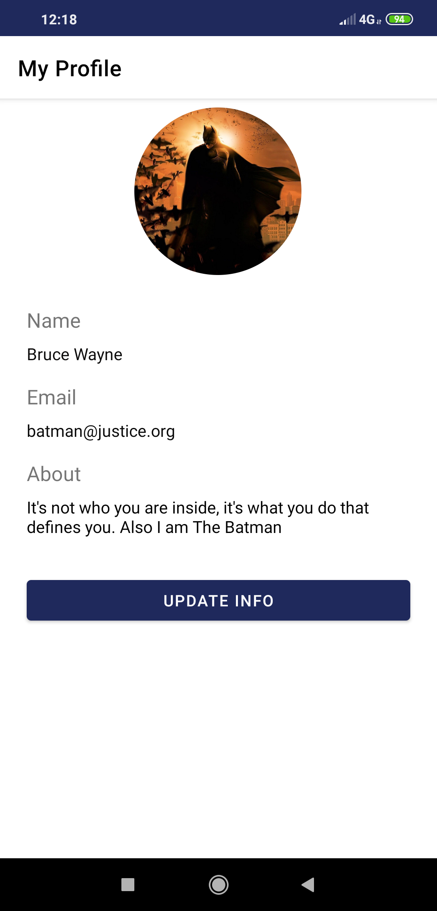
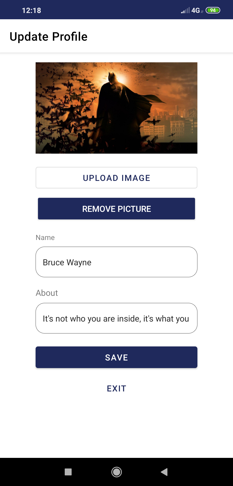

# ChatE
An android chat app built using Firebase Realtime Database and Kotlin.

## Login
One time signup and login.
{:height="50%" width="50%"}

## Chat List
Viewing all the chats with new messages, time displayed.

## Chat
The chat interface with minimilastic features

## My Profile
View your account info and to update.

Update interface

## View other's profile

