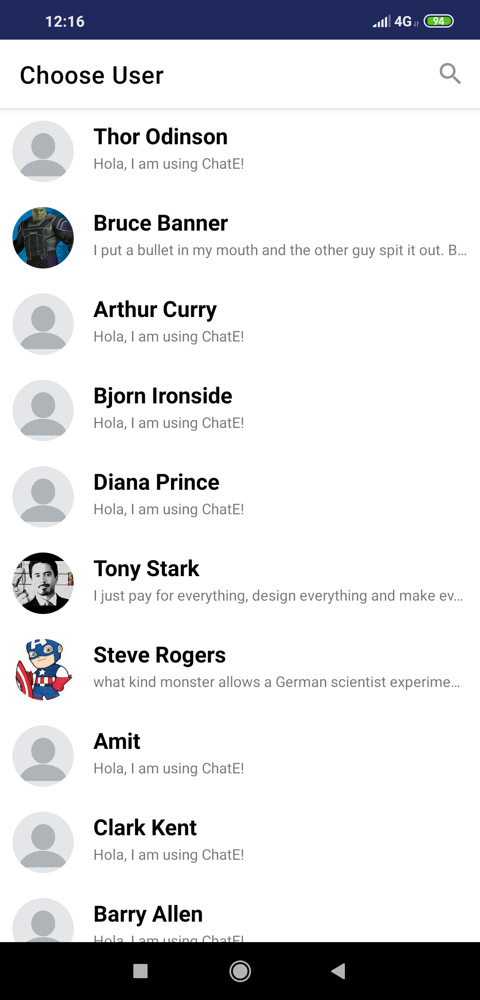
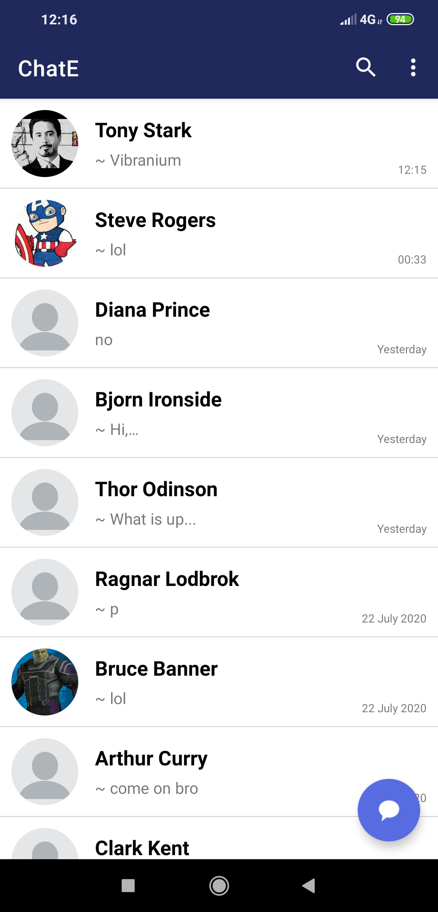

# ChatE
An android chat app built using Firebase Realtime Database and Kotlin.

## Chats
Choose users from all all existing users to chat. One chat per person mantained 
Viewing all the chats with new messages, time displayed. 
The chat interface with minimilastic features.   

## Profiles
View your account info and to update. 
View other people profile also. 
One time login/signup.  

